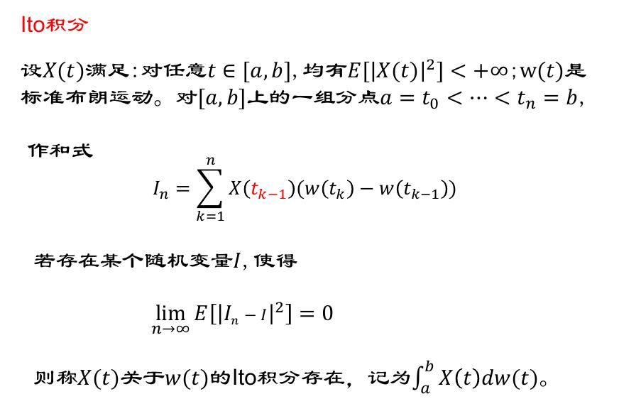
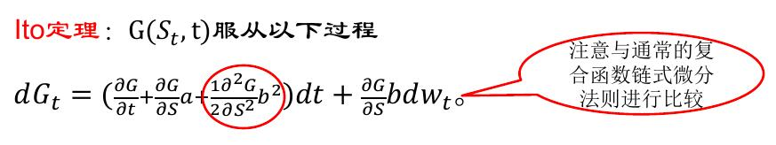
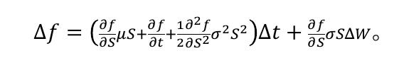
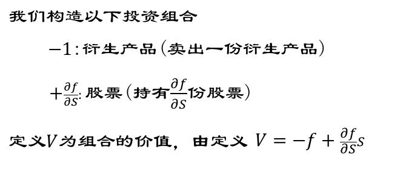
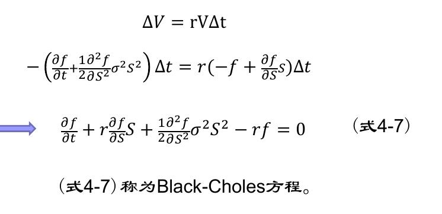

# 数理金融（六）

关于股票价格的**连续时间** 随机过程

### **布朗运动**

#### **什么是布朗运动**

一个随机过程w(t) 称为 **标准布朗运动**，如果满足以下性质：

1. w(0)=0,w(t)关于时间连续
2. 在给定的长度为$$\Delta t$$​​的时间区间上， w(t)的变化量$$\Delta w$$​​服从期望为0、方差为$$\Delta t$$​​的正态分布，即$$\Delta w=\sqrt{\Delta t} \phi ,\phi  \sim N(0,1)$$​​ 。
3. 在任意两个不互相重叠的时间区间上，变化量\Delta w是相互独立的。
4. 第三个性质说明， w(t)服从马尔可夫过程，即w(t)在未来的概率分布只与当前值有关，而不依赖于在过去所遵循的特定路径。换句话说，该过程的当前值包含了对其未来做预测所需的全部信息。

利用matlab模拟[0,T]布朗运动

```matlab
T=1; dt=1/1000; N=1001;
W=zeros(N,1); 
for i=2:N
W(i)=W(i-1)+sqrt(dt)*randn; % randn是生成标准正态随机变量
end
plot([0:dt:T],W)
```


#### **布朗运动的一些应用**

一维布朗运动的走势和股票价格曲线的走势看着非常相似，这变引起人们利用它来描述股票价格走势的兴趣。

 布朗运动 $$\{w (t) , t \geq  0\}$$ 的每一条轨道看起来是不光滑的，甚至是杂乱无章的，但它们是连续的。

 值得注意的是布朗运动$$\{w (t) , t \geq  0\}$$ 的轨道是**不可微**的。

 事实上，$$P( lim_{ \Delta t \rightarrow  0}|\frac {\Delta W_t}{\Delta t}> x)=1$$​​

### **Ito过程与Ito积分**


#### **相关定义**

我们定义xt为Ito过程，如果:

$$dx_t = a(x_t, t)dt + b(x_t, t)dw_t$$

$$dw_t$$是标准布朗运动$W_t$在t时刻的瞬间改变量，$$dw_t$$ ~ $$N(0, dt)$$.

$$a(x_t, t) dt$$和$$b (x_t, t)  dt$$可以理解为$$x_t$$ 在t时刻的瞬间改变量的期望值和方差。𝑎称为过程$$x_t$$的漂移率，𝑏称为$$x_t$$ 的扩散率。、



#### **股票价格过程**

标准布朗运动不是描述股价运动的最佳选择：因为在任意一个时间区间上改变量的期望都是0.

在衍生产品定价中，我们假设服从 Black-sholes模型
$$
dS_t=\mu S_tdt+\sigma S_tdw_t
$$
$$\mu,\sigma$$是常数

$$dS_t$$是资产价格在无穷小的时间间隔内的变化量 

$$dS_t/S_t$$是这段时间内的收益率

所以 $$dS_t/S_t=\mu dt+\sigma dw_t$$

这里称$$S_t$$是一个 **几何布朗运动**；$$\mu$$ 被称作资产阶级的期望收益率；  $$\sigma$$ 被称为资产阶级的波动率。

#### **Ito定理**

假定 $$G(S_t,t)$$是t和$$S_t$$ 的二元函数，$$S_t$$ 服从Ito过程
$$
dS_t=a(S_t,t)dt+b(S_t,t)dW_t
$$


#### **Ito定理的应用**

用Ito定理计算 Ito积分


### **Black-schols方程的推导和应用**

假设股票价格遵循几何布朗运动，即
$$
dS=\mu Sdt+\sigma SdW
$$
假定f为依赖于S的衍生产品价格，f(S,t)，根据Ito定理


近似离散形式：
$$
\Delta S=\mu S\Delta t+\sigma S\Delta dW
$$




由于投资组合在长度为\Delta t的时间上市无风险的，根据无套利原理，无风险投资组合的收益率等于无风险收益率，所以有



1. 欧式看涨期权的价格满足BC方程，其终值条件：$$f(S,T)=(S-K)^+$$
2. 欧式看跌期权的价格满足BC方程，其终值条件：$$f(S,T)=(K-S)^+$$

**注：** 在BC方程中并未出现股票在真实世界里的期望回报率$$\mu$$ ，代替的是无风险收益率，因此BC得到的期权价格和$$\mu$$无关


通过求解 BC方程，欧式看涨与看跌期权的价格如下：

