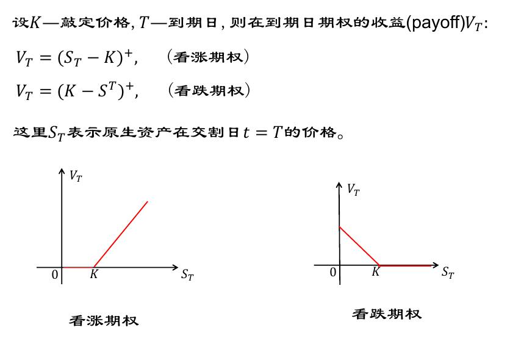

# 数理金融（一）

数理金融相关名词

## **远期合约**

在时刻 t 签定的一份合同

将在时刻T以设定的价格进行笔交易，称为在[t,T]上的一个远期合约.

| 名称              | 含义           |
| ----------------- | -------------- |
| 原生资产/标的资产 | 合约中的物品   |
| 交割价格/远期价格 | 设定的成交价格 |
| 交割日            | 时刻T          |
| 空头              | 卖方           |
| 多头              | 买方           |

在签订合约的当天，客户不需要付出成本

在交割日，该合约必需生效

## ** 期货**

与远期合约相同，在未来确定时间按确定价格交易一定量标的资产的协议

通常在交易所进行交易

有标准化条款

期货价格通常由场内交易决定，依赖于供求关系。

## **期权**

**期权：** 持有人在确定时间，按照确定价格向出售方购销一定原生资产的协议。但是他不承担必须购入或卖出的义务

| 名称               | 含义                     |
| ------------------ | ------------------------ |
| 实施价格或敲定价格 | 确定价格                 |
| 到期日             | 确定日期                 |
| 实施               | 按合约规定进行购买或销售 |

期权可以到期不予实施，是一种未定权益

期权需交纳期权金

期权定价是对这一类未定权益定价

## ** 期权分类**

| 名称     | 含义                                       |
| :------- | :----------------------------------------- |
| 看涨期权 | 在确定时间购入                             |
| 看跌期权 | 在确定时间出售                             |
| 欧式期权 | 只能在合约日期交易                         |
| 美式期权 | 可以再确定日期之前的任意一天交易（工作日） |

### **5.交易者类型**

可以分为三大类：**对冲者**（套期保值者）；**投机者**；**套利者**

**对冲者：**  

1. 利用期货或者期权来减小他们面临的风险（衍生品最初的意义）
2. 一般利用远期合约或者期权进行对冲
3. 远期合约是通过锁定买入或者卖出原生资产的价格进行对冲
4. 期权产品是提供了价格保险，需要支付期权金。

**投机者：**

1. 投机者通过对资产价格变动 **下注** 以小博大获利
2. 期权给投资者提供了杠杆效应。也就是说，期权会方法最终的经济效果：好的收益会更好，坏的收益会更坏

**套利者：**

1. 基于对同一类风险资产的观察，利用市场价格的差异，在不同的市场进行交易，获瞬时的无风险收益。
2. **套利和投机的不同**：
   投机是基于对未来价格水平的预测以谋取利润，有风险；
   但是逃离是利用不同市场在价格上的差异的现实，无风险
3. 由于一旦有套利机会，必然有套利者参与，直至无套利，所以我们只讨论**==无套利原理==** ，即在不存在套利机会的基础上进行研究。

##  **利率**

利率是决定几乎所有衍生产品价格的因素之一。

利率定义了在一定情况下 **借入方** 承诺支付给 **借出方** 的资金数量。

常用： **无风险利率**

衍生产品定价一般是通过建立一个无风险又资组合，然后使瓯子组合的回报率等于无风险利率。

**无风险利率组合** 意味着站在任何一个时间点，该投资组合未来的价值是确定的，不是随机的。

一般来说，国债没有违约风险

**利率的计算：**

 eg. 年利率是 r ，复利 m 次，本金为 A 。

则一年的利息是 $$A \times (1+ \frac{r}{m})^m-A$$

**连续复利：**

当复利频率 m 接近无穷大的时候，对应的理律交 **按连续复利**

eg. 年利率为 r ，按连续复利计，金额 A 投资 x 年后将变成$$Ae^{rx}$$ 。