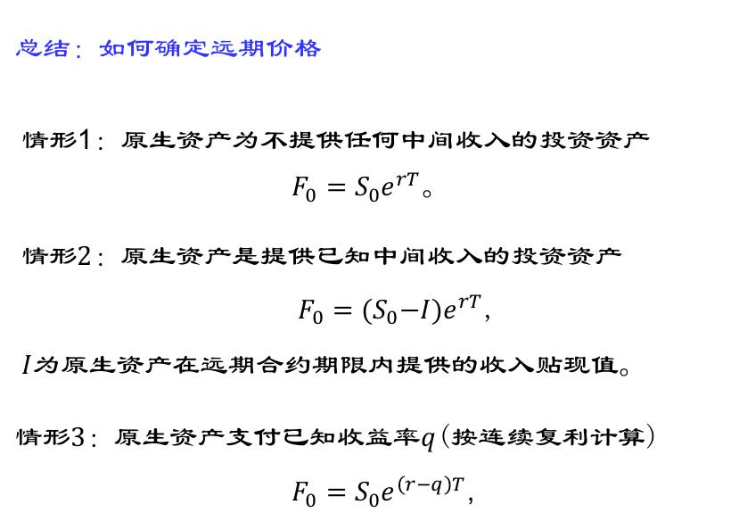

# 数理金融（二）

无套利原理及简单应用

## **无套利原理**

无套利原理是期权定价理论的基础。

**我们假设不存在套利机会**

### **套利机会**：

在 **某时刻** ，客户 **身无分文** 进入市场，通过资产的买卖，允许买空和买空，是的最终不欠债，且有 **正概率** 的机会获得盈利。

### **卖空**：

卖出投资者并不拥有的财产

### ** 金融市场与无套利原理**

在 t 时刻，观察其后某一时刻的资产价格，无风险资产的价格是确定的，分析按资产的价格是不确定的，是一个随机变量。

在本课程中，除非特别指明，我们将假设无风险资产的年收益率为 r ，按连续复利计算，假设无风险资产在 $t_0$ 时刻价格为 $B_{t_0}$ ，则在 $t_1$ 时刻，
$$
B_{t_1}=B_{t_0}\times e^{r(t_1-t_0)}
$$
反之，如果知道 **无风险资产** 在 $$t_1$$ 时刻价格为 $$B_{t_1}$$ ，那么在$t_0$ 时刻
$$
B_{t_0}=B_{t_1}\times e^{-r(t_1-t_0)}
$$
即 以无风险利率r按连续复利进行 **贴现**。

## **自融资**

考虑有无风险资产和若干风险资产组成的 **投资组合** （也称为投资策略）记为 $$\Phi$$ 。若在整个交易其[0,T]内，投资人没有追加新的资金，也没有资金被抽走，那么称 $$\Phi$$是 **自融资** 的。

定义$$V_t(\Phi)$$ 是在 $$\psi$$ 时刻 t 的 价值。

## **套利机会**

一个自融资策略称为在[0,T]内存在 **套利机会** ，如果存在$$t^* \in [0,T)$$，使得$$V_{t^*}=0$$ ，但$$V_T\geqslant 0$$ ，且 $$Prob\{V_T(\Phi) \geqslant 0 \}\geqslant 0$$ ,这里Prob{w}表示时间w发生的概率。

## **一些定义**

**定义2.1** 若对于任意自融资的头则策略在任意时段内都不存在套利机会，那么称市场在该时段内是无套利的。

**定理2.1** 若在一段时间内，无套利投资组合A 和B 满足：在时间段的最后时刻，A的获利比 B多，则对该时间段内任意时刻，A 的获利比 B多。

**定理2.2**  若爱某段时间内市场无套利，投资组合 A和 B 满足：在时间段最后时刻，A和 B的获利相同，则在任意时间，两者均相同。

**推论2.3** 若在某时间段 市场无套利，且投资组合 A 在时间段末的时刻的价值为确定的现金流 F ，则 F 以无风险利率r按连续复利贴现可以孙任意时刻的现金流。

**推论2.3 的更一般情形** 在某一时间段内市场无套利，且资产组合$\psi$在[0,T]内的收益是在 $t_1,t_2$ 和T产生的确定的现金流 $A_1,A_2,A$，假设无风险利率为r，按连续复利及，资产组合$\psi$在0时刻的价值等于
$$
V_0=A_1e^{-rt_1}+A_2e^{-rt_2}+Ae^{-rT}
$$

$$
x1B_{t_1}=B_{t_0}\times e^{r(t_1-t_0)}
$$

**定理2.4** （定理2.1的更强版本）若在[0,T]内市场无套利，投资组合$$\Phi_1$$ $$\Phi_2$$ 满足，$$V_T(\Phi_1)\geqslant V_T(\Phi_2)$$ ,以及$$Prob\{V_T(\Phi_1)> V_T(\Phi_2) \}>  0$$ ,那么对任意时刻$$t \in [0,T)$$ ，必有
$$
V_t(\Phi_1)> V_t(\Phi_2)
$$
**我们经常通过反证法来证明市场无套利**

## **如何确定远期价格**

**一般方法：**

通过买入以单位的原生资产和进入远期合约空头构造无风险的投资组合。

由于市场是无套利的，根据推论2.4，该无风险投资组合在0时刻的价格等于T时刻的价格以无风险利率 r 安连续复利贴现，从而我们可以求出远期价格

**三种情形：**

## **其他**

1. 股指：
   股指一般可以被看作支付股息的投资资产。

2. 远期价格与远期合约价值：
   一种资产的远期价格是交易员在进入合约时刻约定的在未来以此买入或者卖出的该资产的价格。
   刚进入的时候，价值为0，随着时间的推移，会变化，可能为正也可能为负
