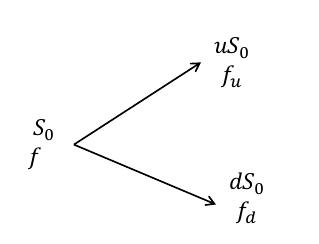

# 数理金融（四）

二叉树模型

## **概述**

期权定价的离散时间模型——二叉树模型

**优点**：简单直观、不需要太高深的数学知识、是一种非常有效且流行的定价方法。

**概述**：

1. 二叉树是用来描述期权期限内**股票价格变动的可能路径**
2. 这种方法假设了股票价格仅在离散时间点上发生变化，并且假设股票价格服从 **随机游走** ，即在每个离散的时间点以概率 p 上升到上一步价格的 u 倍或者以概率 (1-p) 下降到上一步价格的 d 倍。

## **以欧式看涨期权为例**

**题目**：

1. 现有一只股票，当前价格为10元
2. 3个月后股票 的价格变化仅有两种可能性，即可能涨至12元，也可能跌到 8元。
3. 那么以一股该股票为标的，行权价为11元，3个月后到 期的欧式看涨期权现在价格应该是多少呢？

**思考以及解题**：

1. 建立投资组合$\Phi$：持有 A 只股票，同时卖出一份以一股该股票为标的资产的看涨期权。
   这时候，该投资组合是 **无风险组合**

   | 股票价格       | 上涨为12元 | 下跌至8元 |
   | -------------- | ---------- | --------- |
   | 投资组合的价值 | 12 A-1     | 8 A       |

2. 由于 **无风险组合** ，那么 **投资组合在上述两种情况的终端价值相等**
   所以 $$12A-1=8A$$ ,可以求出 A=0.25

3. 由于投资组合 **无风险** ，并且 **市场无套利** ，因此收益率等于无风险收益率。
   根据**无风险收益率**是 4% ，那么投资组合 现值是  2元的贴现值(涨跌幅)
   根据 **按连续复利计无套利公式** $$2e^{-0.04\times 3/12}$$ =1.98

4. 我们假设期权当前的价格是 f 。
   那么现在手中实际的资产是 0.25×10(手中所含有的股票资产)-f(购买期权用掉的资产)=2.5-f，这部分资产相当于之前按连续复利计算的1.98，由此可以求出 f 。

## **单步二叉树期权定价**

问题：

股票当前价格：$$S_0$$ ;看涨期权当前价格： f ；期权有效期： T ；

解：

我们建立一个无风险投资组合：

买入 A 只股票，卖出一份以一只股票为标的的看涨期权。

那么投资组合的价值：

| 上涨        | 下跌        |
| ----------- | ----------- |
| $$AuS_0-f_u$$ | $$AdS_0-f_d$$ |

两个投资组合的价值应该是相等的，由此可以计算出 A ，然后我们可以通过上涨的投资组合的价值进行无套利原理贴现，最后计算出当前价值。

**股票数量A其实是 期权价格差÷股价差**

**上面的构造无风险投资组合的方法叫做 Delta对冲**

## **风险中性定价理论**

当股票满足一不二茶模型的时候，**根据无套利原理** ，我们可以计算期权价格：

$$f=[pf_u+(1-p)f_d]e^{rT}$$ ，其中 $$p=\frac{e^{rT}-d}{u-d}$$ ，我们定义p是上涨概率。

也就是说，**期权的价格等于在到期日的价格期望的贴现值** 。

 同时，假设股票价格上涨的概率 p 实际上是 **假设股票的期望收益率是无风险利率**。

 p 也被称为风险中性概率。

## 风险中性定价

第一步： $$puS_0+(1-p)dS_0=S_0e^{rT}$$

第二步：计算期权在到期日的风险中性期望

第三步：无风险利率贴现
